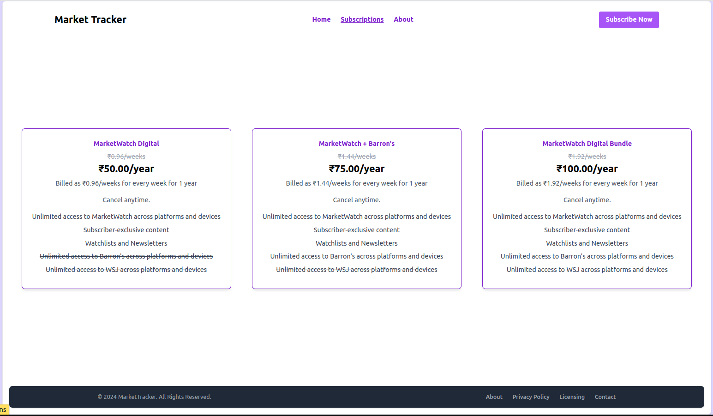
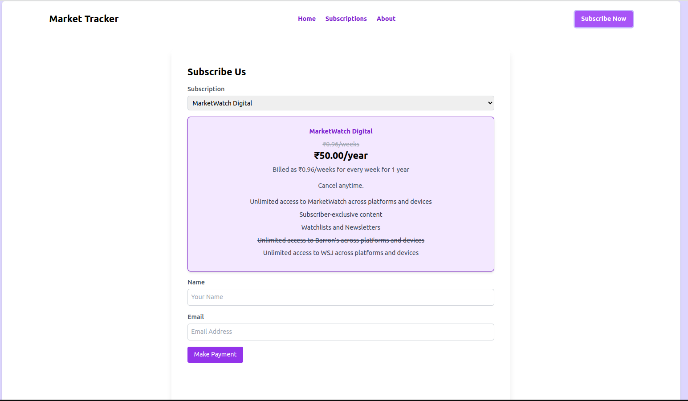
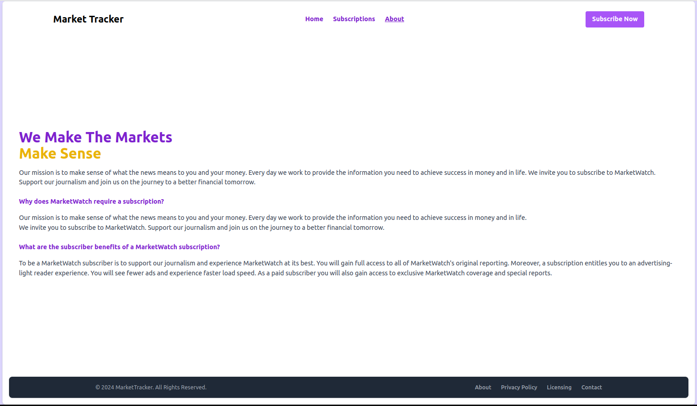

# Market Tracker

Market Tracker is a comprehensive Rails application designed to provide users with daily market updates. Users can explore various subscription plans, contact the admin, and securely make payments for their chosen subscription plan. The application includes features such as Razorpay integration for payments, background jobs for sending emails, an admin panel using Active Admin, and a range of APIs for interacting with different functionalities, added tests using Rspec.


## Features

- **Contact Form**: Users can contact the admin via a user-friendly contact form.
- **Subscription Plans**: Users can view and choose from a variety of subscription plans.
- **Subscription and Payment**: Secure payment processing and subscription management through multiple payment methods.
- **Daily Emails**: Subscribed users receive daily market news and updates via email.
- **Notifications**: Flash messages for both success and error notifications.
- **Styling**: Styled with Tailwind CSS.

## APIs

- **Contact Us**: Allows users to send messages to the admin.
- **Subscriptions**: Provides information about available subscription plans.
- **Subscribe Us**: Manages the subscription process for users.
- **Make Payment**: Handles payment processing using Razorpay.
- **Verify Payment**: Verifies the payment details post-transaction.


#### Prerequisites

- ruby 3.2.2
- rails 7.0.8
- Node 18+, and Yarn 1.x

#### Install

##### 1. Check out the repository

```bash
git clone https://github.com/ravendra-01/market-tracker.git
```

##### 2. Create and setup the database

Run the following commands to install gems.

```ruby
bundle install
```

##### 3. Create and setup the database

Run the following commands to create and setup the database.

```ruby
rails db:create db:migrate db:seed
```

##### 4. Start the Rails server

You can start the rails server using the command given below.

```ruby
rails s
```

And now you can visit the site with the URL http://localhost:3000

## Screenshots

### Home Page


### View Subscriptions


### Subscribe and Pay


### About


## Usage

- **Contact Admin**: Navigate to the home page and fill out the contact us form to send a message to the admin.
- **View Subscriptions**: Go to the subscription page to view available plans.
- **Subscribe and Pay**: Select a subscription plan, fill in the required details, and proceed with the payment.
